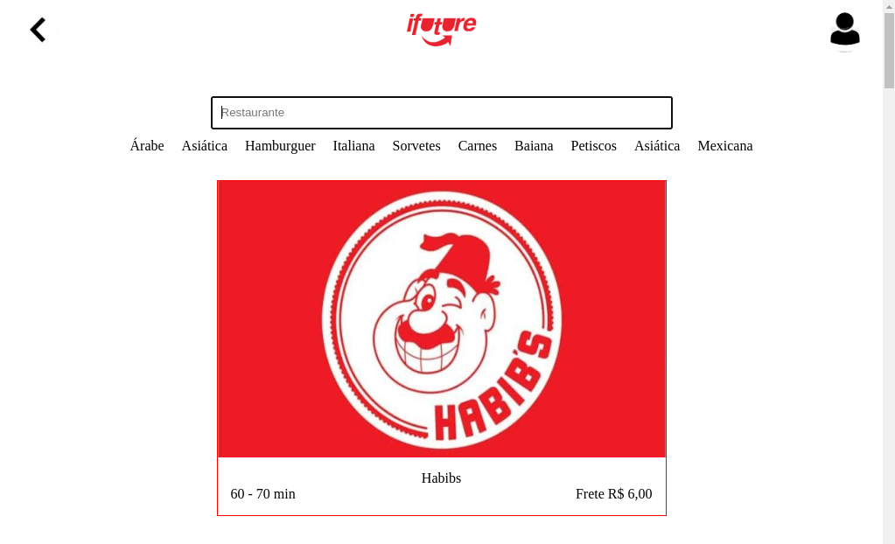
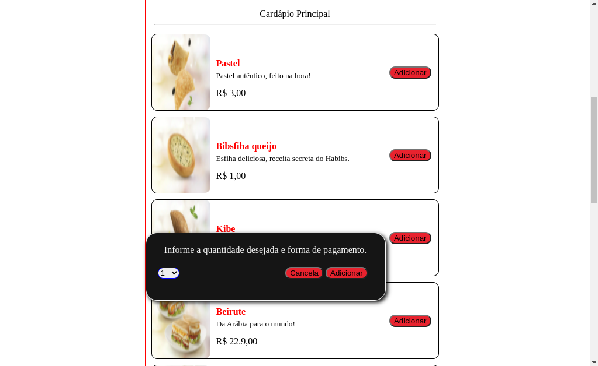
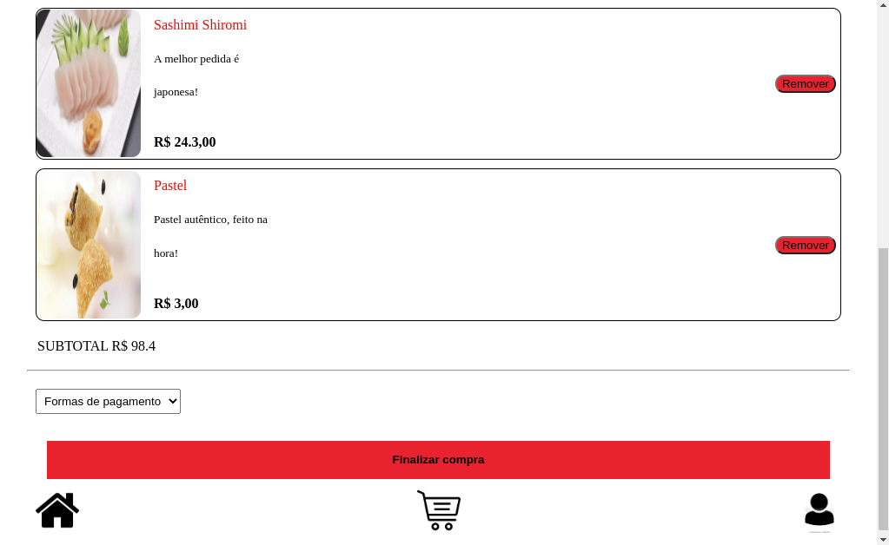
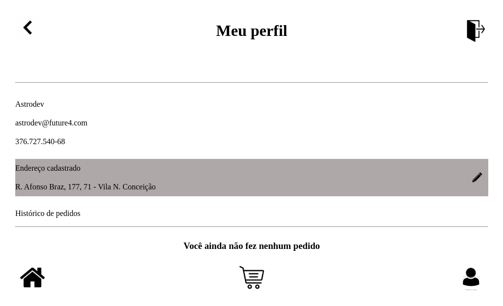

# Labefood

> Aplicação está passando por atualizações
<body>
	
	<h3>Aplicativo web para serviços de restaurantes</h3>
	<ul>
		<li>
			Pagina inicial: Tela com o logo do aplicatio, o qual te redireciona para a tela de login ao ser 
			clicado.
			

		</li>
		<li>
			Feeds: 
			Na pagina de feeds você tem uma lista com os restaurantes, o valor do
			frete e o tempo de entrega. No cabeçalho há uma caixa de texto para busca e logo abaixo
			um filtro com as categorias dos respectivos restaurantes.
			

			Clicando no outdoor de cada restaurante
			você é redirecionado para a pagina de detalhes, onde poderá realizar seu pedido indicando
			o produto e a quantidade. Isso é feito clicando no botão adicionar, quando será 
			aberta uma janela popup.
			

			
		</li>
		<li>
			Carrinho: 
			Na pagina de carrinho está registrado o endereço para entrega, que é o endereço cadastrado pelo usuário, são dispostos também os itens adicionados e seus respectivos valores, o subtotal, ou seja, a soma de todos os valores dos produtos e a forma de pagamento.
			

			Ao fim de tudo está o botão para finalizar compra. 
		</li>
		<li>
			Perfil: 
			Clicando no ícone situado no canto superior direito da página de feeds(segunda imgem de cima pra baixo), ou no canto inferior direito das demais páginas o usuário é redirecionado para página do seu perfil.
			

			Nesta página está o nome, email, CPF e endereço cadastrado do usuário. No canto superior direito há um ícone para deslogar da conta. Também fica registrado o histórico de pedidos, caso tenha feito algum.    
		</li>
	</ul>

>Link da aplicação: https://portfolio-labenu.herokuapp.com/

>Login para acesso: email: astrodev@future4.com | senha: 123456

>Obs.: Ao logar você verá um alerta de erro, você deve simplesmente recarregar a página.
