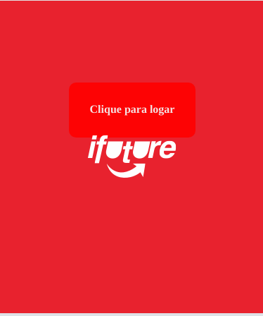

# Labefood

> Aplicação está passando por atualizações
<body>
	
	<h3>Aplicativo web para serviços de restaurantes</h3>
	<ul>
		<li>
			Pagina inicial: Tela com o logo do aplicatio, o qual te redireciona para a tela de login ao ser 
			clicado.
			
		</li>
		<li>
			Feeds: 
			Na pagina de feeds você tem uma lista com os restaurantes, o valor do
			frete e o tempo de entrega. No cabeçalho há uma caixa de texto para busca e logo abaixo
			um filtro com as categorias dos respectivos restaurantes. Clicando no outdoor de cada restaurante
			você é redirecionado para a pagina de detalhes. Onde poderá realizar seu pedido indicando
			o produto e quantidade. Isso é feito clicando no botão adicionar, quando será 
			aberta uma janela popup.
			

			
		</li>
		<li>
			Carrinho: 
			Na pagina de carrinho são dispostos os itens adicionados e seus respectivos valores, o subtotal, ou seja a soma de todos os valores dos produtos e as formas de pagamento.
			

			Ao fim de tudo está o botão para finalizar compra. 
		</li>
	</ul>
